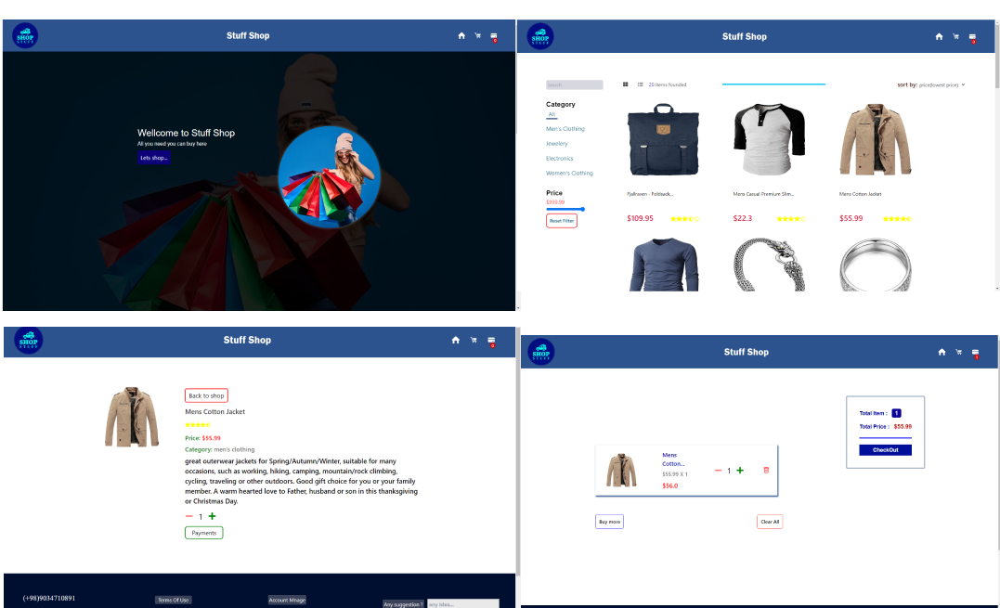

# Next js Redux-toolikt shopping project
## Features:
Search, filter, and sort functions
- Enables users to easily find and sort products based on their preferences.

Simple website structure
- Consists of a home page, products page, single product page and a shopping cart.

Using suspense for optimization

## Demo
See demo on github pages
[Next js Redux toolkit Fake Store](https://kamalheydari.github.io/react-redux-fake-store/)

## Using

- Next js
- Redux-toolkit
- React-icons
- [FakeStoreApi](https://fakestoreapi.com/)
